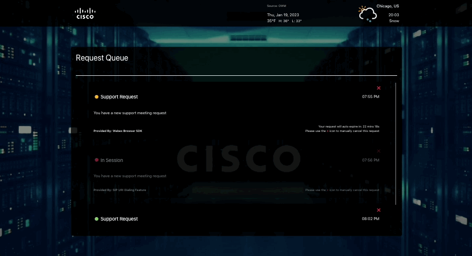
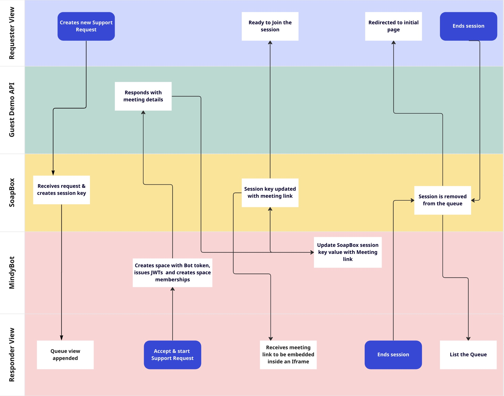
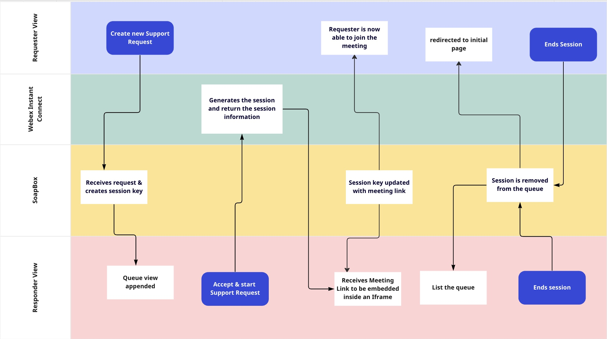

# Webex WebRTC Video Call Queue

**Create a fully customized WebRTC video call queue.**

This is a proof-of-concept application which generates a customized looking queue links to establish Webex backed WebRTC video calls between the requester and responder.

<p align="center">
   <a href="https://app.vidcast.io/share/d5289588-9810-4e4a-9ea5-b85b61816cc3" target="_blank">
       
    </a>
</p>

</br >

# Table Of Contents

- [Overview](#overview)
- [High-Level Architecture](#high-level-architecture)
  - [Prerequisites](#prerequisites)
  - [Browser Meeting SDK](#browser-meeting-sdk)
  - [Instant Connect Solution](#instnat-connect-solution)
- [Setup](#setup)
- [Built With](#built-with)
- [Demo](#demo)
- [Support](#support)

<br />

# Overview

This web application provides a support queue system that could be embedded in E2C use cases and contains two views: Requester & Responder views. As you see in the figure above, there is a list of requests for a responder to manage or address to. In order for the responder to view any requests, they would need any requester to submit a request. Once a requester has submitted a request, responder will have few options to manage the request. Responder is able to skip or address the request by starting a session with the requester. This PoC is designed to address some of the use cases mentioned below:

<i>"I need a WebRTC video solution embedded in our built-in native app to connect customers to experts." </i> <br/>
<i>"I need a branded WebRTC supported video call queue solution to connect two parties without asking them to login."</i> <br/>
<i>"I need a click-to-call support feature embedded in my Cisco board Pro to connect incoming lobby guests to lobby ambassadors"</i> <br/>
<br />

# High Level Architecture

## Prerequisites

This PoC leverages a few services behind the scene to provide a FIFO orderly queue system to manage requests and establish a WebRTC connections between the responder and requester. Here is the list of services that are required before launching the application. Make sure to review our env.example file to input the right values before running the app locally.

<ol>
<li><a href="https://github.com/wxsd-sales/soapbox" target="_blank">SoapBox</a> - A websocket message broker link must be provided to establish a WSS connection between the responder and requester</li>
<li><a href="https://github.com/wxsd-sales/wxsd-guest-demo" target="_blank">Guest Demo</a> - To generate and embed the meeting experience into support flow</li>
<li><a href="https://github.com/wxsd-sales/mindy-bot-refactored" target="_blank">Mindy Bot</a> - To manage guest users and to perform space and memberships creations</li>
<li><a href="https://instant.webex.com/" target="_blank">Webex Instant Connect</a> - To embed Webex IC flow into the support flow, Instant Connect must be activated</li>
</ol>

## Browser Meeting SDK

### Requester Flow

Establishes a WebSocket connection to SoapBox to publish the request data and subscribe to queue & meeting management events.

### Responder Flow

<ol>
<li>Establish a WebSocket connection to SoapBox to register queue events</li>
<li>Send HTTPs POST request to Mindy BOT</li>
<li><a href="https://github.com/wxsd-sales/mindy-bot-refactored" target="_blank" >Mindy Bot</a> Node Service
   <ol>
      <li> Issues JWTs</li>
      <li> Create an Space</li>
      <li> Create Space memberships with newly generated guest tokens</li>
      <li> Retrieve a meeting link using <a href="https://github.com/wxsd-sales/wxsd-guest-demo" target="_blank" >Guest Demo</a> API</li>
      <li> Update registered soapbox session with meeting details</li>
   </ol>
</li>
<li> Responder and requester clients receive the meeting information from the SoapBox
<li> Responder Client initiates Browser Meeting SDK to register Meeting related events </li>
<li> Responder Client publishes queue <strong>pop</strong> & meeting related events back to requester client </li>
</li>
</ol>
<p align="center">
   
</p>

<br />

## Instant Connect Solution

### Requester Flow

Establishes a WebSocket connection to SoapBox to publish the request data and subscribe to queue & meeting management events.

### Responder Flow

<ol>
<li> Establishes a WebSocket connection to SoapBox to register queue related events</li>
<li> Sends HTTPs POST request Instant Connect</li>
<li> Receives IC meeting url to join </li>
<li> Responder Client initiates Browser Meeting SDK to register Meeting related events </li>
<li> Responder Client publishes queue <strong>pop</strong> & meeting related events back to requester client </li>
</li>
</ol>
<p align="center">
   
</p>

<br />

# Setup

These instructions assume that you have:

- [Docker installed](https://docs.docker.com/engine/install/) and running on a Windows (via WSL2), macOS, or Linux machine.

Open a new terminal window and follow the instructions below to setup the project locally for development/demo.

1. Clone this repository and change directory:

   ```
   git clone https://github.com/wxsd-sales/video-queue && cd video-queue
   ```

2. Copy `.env.example` file as `.env`:

   ```
   cp .env.example .env
   ```

3. Review and follow to [Register your Integration on Webex](https://developer.webex.com/docs/integrations#registering-your-integration) guide.

   - Your registration must have the following [Webex REST API scopes](https://developer.webex.com/docs/integrations#scopes):
     | Scope | Description |
     |---------------------------|----------------------------------------------------------------------------------|
     | spark-people | See details for any device in your organization |
     | spark:kms | Permission to interact with encrypted content |
   - Use these Redirect URIs:
     - `https://localhost/auth/webex/callback`
     - `http://localhost/auth/webex/callback`
   - Take note of your Client ID and Client Secret. Assign these values to the `WEBEX_AUTHORIZATION_CODE_CLIENT_ID`
     and `WEBEX_AUTHORIZATION_CODE_CLIENT_SECRET` environment variables within the `.env` file respectively.

4. Review and follow the [Creating a Webex Bot](https://developer.webex.com/docs/bots#creating-a-webex-bot) guide.
   Take note of your Bot ID and Bot access token. Assign these values to the `WEBEX_BOT_ID` and
   `WEBEX_BOT_TOKEN` environment variables within the `.env` file respectively.

5. Set other environment variables as needed in the `.env` file.

6. Start the application using:
   ```
   docker-compose up
   ```

Lastly, navigate to `http://localhost` in your browser and follow instructions.

<br />

# Built With

- [Webex Browser SDK](https://github.com/webex/webex-js-sdk)
- [Webex Instant Connect](https://instant.webex.com/)
- [SvelteJS](https://reactjs.org)
- [TypeScript](https://www.typescriptlang.org/)

<br />

<!-- CONTRIBUTING -->

# Contributing

Contributions are what make the open source community such an amazing place to be learn, inspire, and create. Any contributions you make are **greatly appreciated**.

1. Fork the Project
2. Create your Feature Branch in your forked repo (`git checkout -b myrepo/AmazingFeature`)
3. Commit your Changes (`git commit -m 'Add some AmazingFeature'`)
4. Push to the Branch (`git push origin myrepo/AmazingFeature`)
5. Open a Pull Request

<!-- LICENSE -->

## License

Distributed under the MIT License. See `LICENSE` for more information.

<!-- CONTACT -->

## Contact

Please reach out to the WXSD team at [wxsd@external.cisco.com](mailto:wxsd@external.cisco.com?cc=ashessin@cisco.com&subject=Azure%20Group%20Sync).
