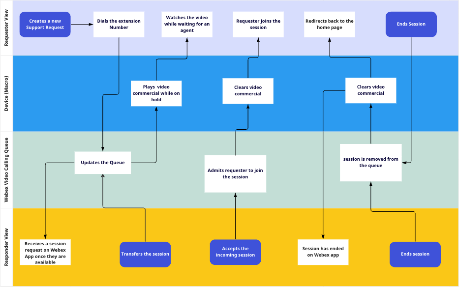
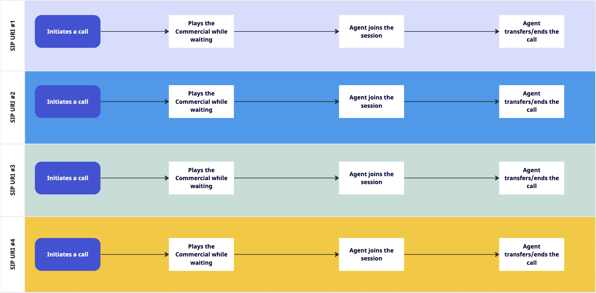

# Webex WebRTC Video Call Queue

**Create a fully customized WebRTC video call queue.**

This is a proof-of-concept custom-branded application that enables users to dial into a video call queue powered by Webex Call Management Group, facilitating a structured connection between the requester and the agent.

<p >
   <a href="https://app.vidcast.io/share/fd2c4347-f94e-4c0c-9a39-348397abed73" target="_blank">
       
    </a>
</p>

</br >

# Table Of Contents

- [Overview](#overview)
- [High-Level Architecture](#high-level-architecture)
  - [Prerequisites](#prerequisites)
  - [SIP URI Dialing](#sip-uri-dialing)
  - [Multiple SIP URI Dialings](#multiple-sip-uri-dialings)
- [Setup](#setup)
- [Built With](#built-with)
- [Demo](#demo)
- [Support](#support)

<br />

# Overview

This web application offers a support queue system that can be integrated into E2C use cases. It empowers demo builders to craft a custom-branded experience, enabling users to dial into up to 4 queues, each tailored to provide a unique experience while awaiting connection to an agent. This Proof of Concept (PoC) is specifically designed to address the following use cases:

<i>"To enhance the customer experience, I aim to provide a welcoming greeting as they enter the lobby to be connected with the lobby ambassador."</i> <br/>
<i>"I want my support team to be available 24 hours, covering all areas of the workplace, to address any support issues in real time."</i> <br/>
<br />

# High Level Architecture

## Prerequisites

This PoC leverages a Webex Group Call Management feature powered by Webex Cloud Calling behind the scene to provide queue system to manage requests and establish a SIP connections between the responder and requester. Here is the list of services that are required before launching the application. For more information please click [here](https://cisco.sharepoint.com/:b:/s/WXSD-WebexSolutionsDevelopment/EQJu96KU411LpGw16KdT4ewBwZsAOl7NEH_Tnprt6UX4tA)

## SIP URI Dialing

### Requester Flow

User dials into call queue in kiosk mode with SIP protocol handler feature enabled on the device, to connect to the responder.

### Responder Flow

Responder will receive incoming calls once they are available, Responder could also transfer the call back in the queue or end the call.

<p align="center">
   
</p>

<br />

## Multiple SIP URI Dialings

As indicated in the title, this workflow closely parallels the one detailed earlier. The sole distinction lies in the augmentation of user capabilities for SIP URI dialing management, encompassing functionalities such as addition, removal, and updates. The architectural design remains consistent with the previously illustrated framework.

<p align="center">
   
</p>

<br />

# Setup

These instructions assume that you have:

- [Docker installed](https://docs.docker.com/engine/install/) and running on a Windows (via WSL2), macOS, or Linux machine.

Open a new terminal window and follow the instructions below to setup the project locally for development/demo.

1. Clone this repository and change directory:

   ```
   git clone https://github.com/wxsd-sales/video-queue && cd video-queue
   ```

2. Copy `.env.example` file as `.env`:

   ```
   cp .env.example .env
   ```

3. Review and follow to [Register your Integration on Webex](https://developer.webex.com/docs/integrations#registering-your-integration) guide.

   - Your registration must have the following [Webex REST API scopes](https://developer.webex.com/docs/integrations#scopes):
     | Scope | Description |
     |---------------------------|----------------------------------------------------------------------------------|
     | spark-people | See details for any device in your organization |
     | spark:kms | Permission to interact with encrypted content |
   - Use these Redirect URIs:
     - `https://localhost/auth/webex/callback`
     - `http://localhost/auth/webex/callback`
   - Take note of your Client ID and Client Secret. Assign these values to the `WEBEX_AUTHORIZATION_CODE_CLIENT_ID`
     and `WEBEX_AUTHORIZATION_CODE_CLIENT_SECRET` environment variables within the `.env` file respectively.

4. Review and follow the [Creating a Webex Bot](https://developer.webex.com/docs/bots#creating-a-webex-bot) guide.
   Take note of your Bot ID and Bot access token. Assign these values to the `WEBEX_BOT_ID` and
   `WEBEX_BOT_TOKEN` environment variables within the `.env` file respectively.

5. Set other environment variables as needed in the `.env` file.

6. Start the application using:
   ```
   docker-compose up
   ```

Lastly, navigate to `http://localhost` in your browser and follow instructions.

<br />

# Built With

- [SvelteJS](https://reactjs.org)
- [TypeScript](https://www.typescriptlang.org/)

<br />

<!-- CONTRIBUTING -->

# Contributing

Contributions are what make the open source community such an amazing place to be learn, inspire, and create. Any contributions you make are **greatly appreciated**.

1. Fork the Project
2. Create your Feature Branch in your forked repo (`git checkout -b myrepo/AmazingFeature`)
3. Commit your Changes (`git commit -m 'Add some AmazingFeature'`)
4. Push to the Branch (`git push origin myrepo/AmazingFeature`)
5. Open a Pull Request

<!-- LICENSE -->

## License

Distributed under the MIT License. See `LICENSE` for more information.

<!-- CONTACT -->

## Contact

Please reach out to the WXSD team at [wxsd@external.cisco.com](mailto:wxsd@external.cisco.com?cc=ashessin@cisco.com&subject=Azure%20Group%20Sync).
